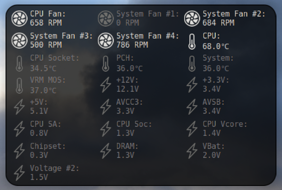
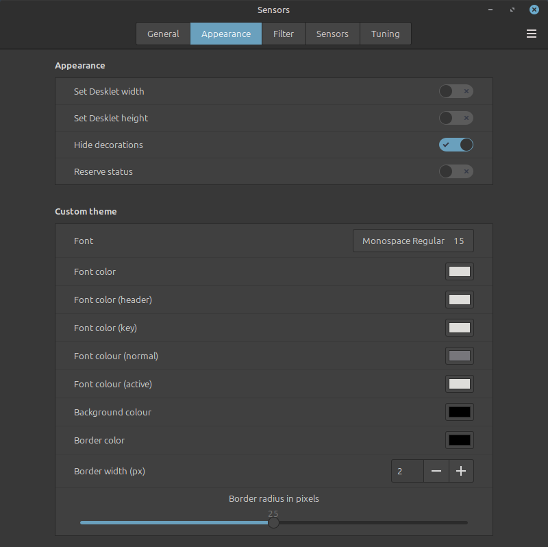
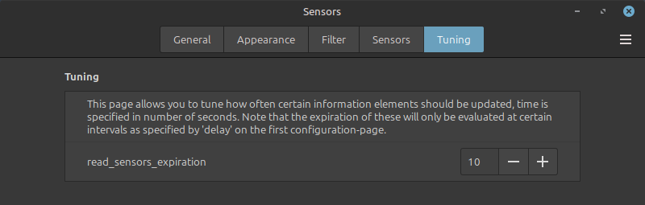
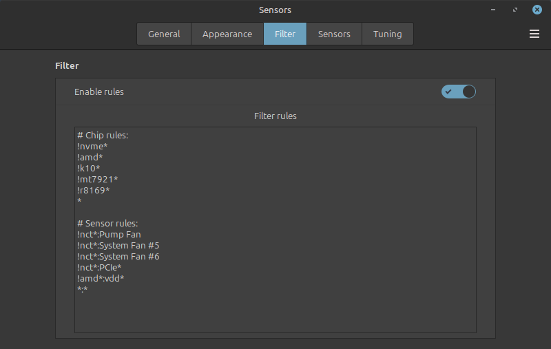
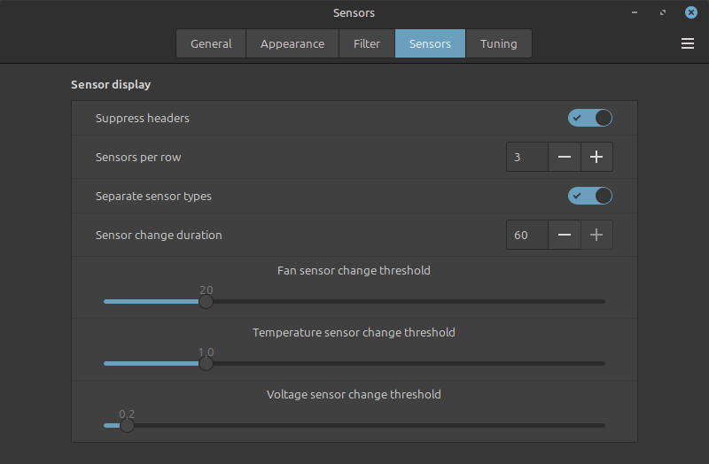

# Sensors Desklet
When building up a new stationary computer I needed a way to observe system temperatures, voltages and fan RPMs. While there are plenty of applications available that will provide that information in a far more detailed manner, I wanted something that would simply live on the desktop and only light when there are relevant changes. The information is provided by *lm-sensors*, a package that needs to be installed and functioning for the Desklet to display anything relevant.



## Requirements
- *lm-sensors*-package, installed and configured.

## Installation
Installed desklets in general be found within the path `~/.local/share/cinnamon/desklets/`, and installation involves moving a copy of this desklet to this folder. First things first, you need to install *lm-sensors*. With that working, you can install the desklet itself.

### 1. Install lm-sensors
I'm not going to go into great detail on this point, there are resources online that'll go into far more detail than what I would be able to correctly regurgitate. The following however are a list of the steps taken, steps that worked for me that one time I did it:

```
apt install lm-sensors
```

If all that works, you need to set it up using `sensors-detect`. While it will ask you stunning amount of questions, including some that hint at potential doom and gloom if you were to answer them incorrectly - I just blindly hit ENTER on them to go with safe choices. Again, this is not a recommendation; just a reflection on my own life choices.  
```
sudo sensors-detect
```

Ensure that you've got at least some results when running the `sensors`-command manually. If you don't get anything relevant, you may be using hardware that's simply too new for - have a look at [A warning about lm-sensors](#a-warning-about-lm-sensors) below for some more information. Go back to the previous step if you've found a module or two that might provide something more, you may also need to reboot.
```
sensors
```

### 2. Install desklet
Installed desklets in general be found within the path `~/.local/share/cinnamon/desklets/`, and installation involves moving a copy of this desklet to this folder. To do so you have the option of cloning this repository along with potentially untested changes, then use the `install.py`-script to move everything where they inevitably need to go in order to function:

```
git clone git@github.com:tebl/Cinnamon-Desklet-Sensors.git
cd Cinnamon-Desklet-Sensors
./install.py -i
```

Alternatively, you can choose to download the latest [release](https://github.com/tebl/Cinnamon-Desklet-Sensors/releases). The entry you're looking for has a name in the form of 'sensors-vX.X.zip', the other entries will be complete copies of the entire repository. Then unzip that into `~/.local/share/cinnamon/desklets/`, a task that can be performed like this:
```
unzip sensors-vX.X.zip -d ~/.local/share/cinnamon/desklets/
```

With the files in the correct place, you can add the desklet to your desktop.


### A warning about lm-sensors
While *lm-sensors* is a package that is available and depended upon by most distributions, it's a project that has absolutely zero active developers. This haven't changed for 5 years by the time of writing this. So why is everyone using it?

Because it works, and currently there's **no real alternative** (that I'm aware of).

Why shouldn't everyone use it? Because it's not updated. As a result of that, it doesn't support any new hardware that've been sold since the last developer left the project. On the other hand there are still people writing code so that *lm-sensors* can work with that hardware.

For my "AMD AM5 B650"-motherboard mentioned elsewhere, a quick search pointed to the fact that my specific MSI-branded motherboard uses the *Nuvoton 6687-R*, requiring the installation of and extra kernel module - [NCT6687D](https://github.com/Fred78290/nct6687d). This is how I solved this particular problem for my machine, beyond offering my experience with that machine I can't offer you any additional assistance on how to setup *lm-sensors* relating to your specific hardware.

## Configuration
The desklet should function by itself from the point that it is added, but without configuration it would more sensors than you'd actually want. For that reason, it is recommended that you start by right-clicking on hit to configure it. On the filter-tab you can set up rules to specifiy which sensors you're interested in, more on that below.

### Customization
You can use the themes provided, or you can attempt to create your own by selecting "Custom". When doing this, you'll be able to customize colors, fonts etc in the search for something that's just a little bit better than what I've been able to throw together. If, like me, you do not enjoy having a desklet that will seemingly bounce around as it's content changes, you also have the option to force a specific desklet width and/or height. Note that the "Sensors"-tab also provide some options for configuring the layout used, mainly allowing you to select how many sensors to show per line.



### Filtering entries
The desklet by default updates every second by default, this takes care of rendering the screen as well as evaluating which information gathering tasks are currently pending. This includes tasks such as actually running the sensors-command to gather sensor telemetry, but how often we do so is configurable in the tuning-section so that you can individually set how often such processes will be run.



Within the filter-section, you can opt to filter out certain types of sensors - *lm-sensors* to the best of my knowledge, includes sensors for temperature, fan speed and voltage. You will however find that *lm-sensors* include sensors from many sources, not all of them relevant - and you'll want the ability to perform some filtering. A simplified scheme for this has been included, and here's what the default ruleset may look like:
```
# Chip rules:
!ignored_chip*
*

# Sensor rules:
!other_chip:faulty_sensor*
*:*
```
While initially a bit confusing, the format becomes a bit clearer once you realize that there's two sets of lists - the first one only applies to what *lm-sensors* consider a *chip* (for us old Windows-dwellers it's what we would have referred to as a driver), the second lists rules that apply to specific sensors. A rule matching such a *chip* can either be written out to match the complete name, or only the first part of it by the use of a single asterisk ('*'). When writing a rule to match a specific sensor we first need to match the chip it applies to, therefore the rule has two sections with a colon (':') between the two. Both sections of the rule follow the same format.



Any rule can also negate certain entries by adding an exclamation point ('!') to the start of it, this allows you to remove specific *chips* you're not interested in. This also is relevant for sensors so that you can remove malfunctioning sensors. A common cause of such sensors is due to a hardware controller supporting the existance of such a sensor, but the actual physical sensor does not exist. Note that while a sensors can't be matched in any way if the chip isn't matched for inclusion. 

As for actually writing the rules, you can write them to include everything by adding a catch-all as the last rule for *chips* and *sensors*, '*' or '*:*' respectively. You would then add negation matches above that, filtering out everything you do not want - one by one. On the plus-side, this allows any newly supported sensors to be picked up by the desklet as these become available. Alternatively you opt out of that, only explicitly including *chips* as needed - you'll also need to add relevant sensor rules for it.

Included below is the ruleset I'm currently using with a common *AMD B650 AM5* motherboard:
```
# Chip rules:
!nvme*
!amd*
!k10*
!mt7921*
!r8169*
*

# Sensor rules:
!nct*:Pump Fan
!nct*:System Fan #5
!nct*:System Fan #6
!nct*:PCIe*
!amd*:vdd*
*:*
```

### Renaming entries
In the practical world there is the issue of actually remembering what the various entries refer to, and in particular how logical names relate to the physical world. In order to alleviate that somewhat, you have the option of using rules for changing **display names**. Such value always start with a dollar sign ('$') and should have a value assigned to it, and similar to other rules you can match a name directly or use partial matches.

```
$nct*=Motherboard
$nct*:System Fan #1=Top Exhaust
$nct*:System Fan #2=Front Top
$nct*:System Fan #3=Front Bottom
$nct*:System Fan #4=Rear Exhaust
```

As previously mentioned this only affects *display names*, meaning that any other type of rule will still require you to use their original names. There is however an intentional possibility for overlapping names, allowing you to group entries together as you please. In the case of overlapping sensor names the result will be a little more unpredictable as one will overwrite the other, in such a case you would need to rename overlapping sensors.

The following example shows how multiple *nvme*-entries can be combined, first by removing all other sensor entries except "Composite" then adding rules to rename the specific entries to something that won't overlap:

```
# Chip rules:
nvme*
*

# Sensor rules:
!nvme-pci*:Sensor*
*:*

# Rename rules:
$nvme*=M.2
$nvme-pci-1*:Composite=Slot A
$nvme-pci-0*:Composite=Slot B
```


### Sensor changes
While *lm-sensors* use terms such as *maximum*, *minimum*, *alarm* etc, I don't really know how relevant these are for an average desktop user - so at the moment I'm just ignoring them entirely. Instead the desklet tries to do watch sensors in order to determine which of them would appear to change between sensor data update - sensors matching this criteria will be highlighted in the desklet. As there will inevitably be some inaccuracies in the values returned due to their physical limitations, a sensor needs to have changed **more** than the configured threshold in order to be counted as *changing*.



Finding the *sweet spot* between what you'd consider *relevant* or just plain *noise* will take some tuning. The recommended way is to set the threshold slider to a low level before gradually turning it up until it stops highlighting on small fluctuations.

## What can be improved?
* No attempt at translation have been made.
* Add "nvidia-smi"-output as a pseudo-chip entry
